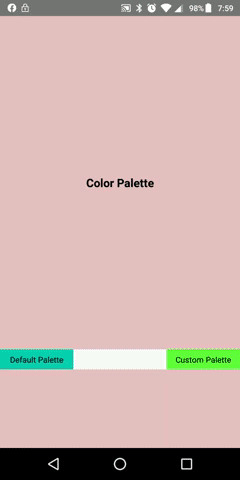

## RNColorPalette (Android & IOS)
A color Picker for React Native Devs :)

Below you will find some information on how to perform common tasks.<br>


## Table of Contents

- [What's new](#whats-new)
- [Installation](#installation)
- [Props](#props)
- [Pull Requests](#pr)
- [License](#license)


## Demo


## Features


## Installation

Install the package in your project's folder by using npm or yarn:

```
npm install @iomechs/rn-color-palette
```
or
```
yarn add @iomechs/rn-color-palette
```

## Basic Usage

Import RNColorPalette in your AppComponent as below:

```
import RNColorPalette from '@iomechs/rn-color-palette';

<RNColorPalette
 colorList={colors}
  value={pickedColor2}
  onItemSelect={this.colorPicked2}
  AddPickedColor={colour => this.AddColor(colour)}
  style={{
    backgroundColor: pickedColor2,
    width: 110,
    height: 30,
}}>
```


## Props


## Pull Requests

Feel free to make Pull Requests for your feature/fix.
To run the project, run
```
npm install
```
or
```
yarn
```
then
```
npm start
```
## Props

| Props  |  Type  | isRequired | Example                                                                                                                                            |
| :----- | :----: | :--------: | :------------------------------------------------------------------------------------------------------------------------------------------------- |
| color  | string |     No     | `'Default is SkyBlue'`, `'green'` or `'#fb6249'` or ` 'rgb(255, 26, 26)'``// If you want Progress bar Opaque, You can use rgba(...) or hsla(...) ` |
| height | number |     No     | `'Should be a Number, 4 is default'`                                                                           

## License
MIT © [IOMechs](https://github.com/IOmechs)